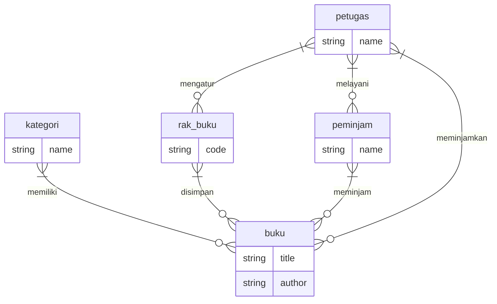

## ERD SISTEM PERPUSTAKAAN

```mermaid
erDiagram
buku {
    string title
    string author
}
kategori {
    string name
}
rak_buku {
    string code
}
peminjam {
    string name
}
petugas {
    string name
}

kategori }|--o{ buku : memiliki
rak_buku }|--o{ buku : disimpan
peminjam }|--o{ buku : meminjam
petugas }|--O{ buku : meminjamkan
petugas }|--o{ peminjam : melayani
petugas }|--o{rak_buku : mengatur

```