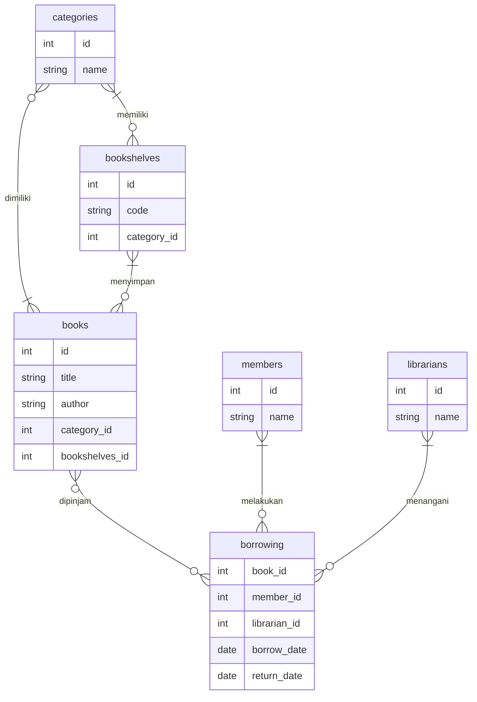

## ERD SISTEM PERPUSTAKAAN

```mermaid
erDiagram
books {
    int id
    string title
    string author
    int category_id
    int bookshelves_id
}

categories {
    int id
    string name
}

bookshelves{
    int id
    string code
    int category_id
}

members {
    int id
    string name
}

librarians {
    int id
    string name
}

borrowing {
    int book_id
    int member_id
    int librarian_id
    date borrow_date
    date return_date
}

categories }|--o{bookshelves : memiliki

categories }o--|{books: dimiliki
bookshelves }|--o{books: menyimpan

books }o--o{ borrowing: dipinjam
members }|--o{borrowing : melakukan
librarians }|--o{borrowing : menangani
```