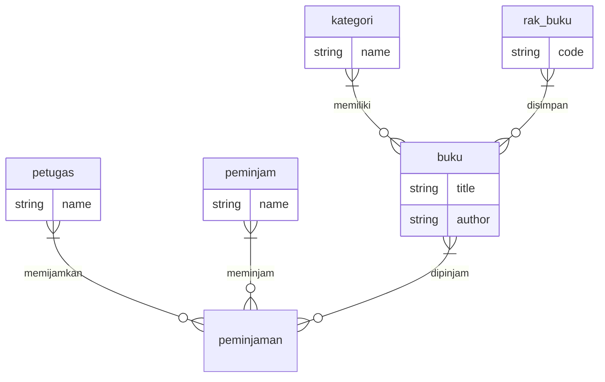

## ERD SISTEM PERPUSTAKAAN

```mermaid
erDiagram
buku {
    string title
    string author
}
kategori {
    string name
}
rak_buku {
    string code
}
peminjam {
    string name
}
petugas {
    string name
}
peminjaman{
}

kategori }|--o{ buku : memiliki
rak_buku }|--o{ buku : disimpan
petugas }|--o{ peminjaman: memijamkan
peminjam }|--o{ peminjaman: meminjam
buku }|--o{ peminjaman: dipinjam

```